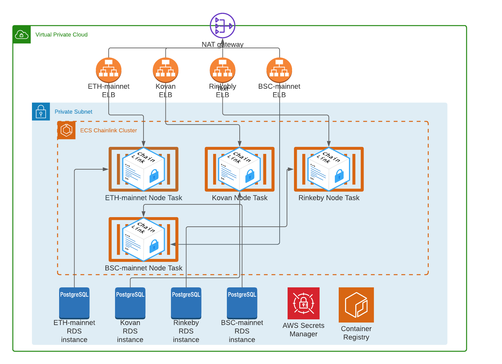

# Chainlink Node Infrastructure 

This project is currently a work in progress. This TypeScript CDK project is for
deploying a highly available Chainlink Node deployment based on Chainlink's documented [best practices](https://docs.chain.link/docs/best-security-practices).
This CDK application currently will deploy the following into the default AWS environment:
- 1 vpc (for the following to be deployed into)
- 3 availability zones
- 1 ECS cluster 
- 1 RDS instance for each of the following:
- 1 Rinkeby network Chainlink node Fargate task 
- 1 Kovan network Chainlink node Fargate task 
- 1 Ethereum Mainnet network Chainlink node Fargate task 

The nodes are provisioned in a private subnet without access to the internet. Each node is also provisioned with an RDS postgres instance, an elastic load balancer listening on HTTP and a AWS Secrets manager record with the RDS instance credentials. 

Node logs are currently be logged to AWS Cloudwatch. TODO: Implement alerts on cloudwatch events and to add uptime 



## Pre-Deployment
Before running this CDK application you will want to make sure you have the [AWS CDK](https://docs.aws.amazon.com/cdk/latest/guide/work-with.html#work-with-prerequisites) installed and configured for TypeScript. 
The application expects that you have a DNZ zone managed in route53 to be used for the load balancers. The app also expects that your have an ACM certificate available for the domain managed by route53. 
You will need the ARN of the SSL certificate for deployment of your nodes.

[Resources for configuring domain in route53](https://docs.aws.amazon.com/Route53/latest/DeveloperGuide/migrate-dns-domain-in-use.html)

[Resources for configuring domain in ACM](https://docs.aws.amazon.com/acm/latest/userguide/gs-acm-request-public.html) 

## Deployment 
* Make sure your AWS credentials are configured for the desired environment
 * `cdk bootstrap`   bootstrap your CDK environment 
 * `cdk deploy InfraStack`  deploy the infra/vpc/cluster to your default AWS account/region
 
There is a deployment wrapper script that is used for deploying the actual nodes. This allows you to specify the UI credetials and wallet password on the command line. This could potentially be useful in some CI processes. 
 
 * `./deploy_cdk.sh "$API_USER" "$API_PASSWORD" "$PASSWORD" "wss://$ETH_URL" rinkeby-node --context hostedZoneName=YOURDOMAIN.COM --context certificateArn=$ACM_CERT_ARN` deploy Rinkeby Chainlink node with rds instance, and associated secret
 * `./deploy_cdk.sh "$API_USER" "$API_PASSWORD" "$PASSWORD" "wss://$ETH_URL" kovan-node --context hostedZoneName=YOURDOMAIN.COM --context certificateArn=$ACM_CERT_ARN` deploy Kovan Chainlink node with rds instance, and associated secret
 * `./deploy_cdk.sh "$API_USER" "$API_PASSWORD" "$PASSWORD" "wss://$ETH_URL" mainnet-node --context hostedZoneName=YOURDOMAIN.COM --context certificateArn=$ACM_CERT_ARN ` deploy Mainnet Chainlink node with rds instance, and associated secret

The wrapper script and be bypassed exported the variables as environment variables:
```
$ export API_USER="user@domain.com" \
  export API_PASS="r4nd0mUIpa55wordstr1ng" \
  export PASSWORD="r4nd0mW4ll3tpa55wordstr1ng" \
  export ETH_URL="wss://kovan.infura.io/ws/v3/$PROJECT_ID" \
  cdk deploy kovan-node
```

One deployed the app will export the LB url to used for logging into the node's UI. 


### Useful commands
 * `npm run build`   compile typescript to js
 * `npm run watch`   watch for changes and compile
 * `npm run test`    perform the jest unit tests
 * `cdk diff`        compare deployed stack with current state
 * `cdk synth`       emits the synthesized CloudFormation template
